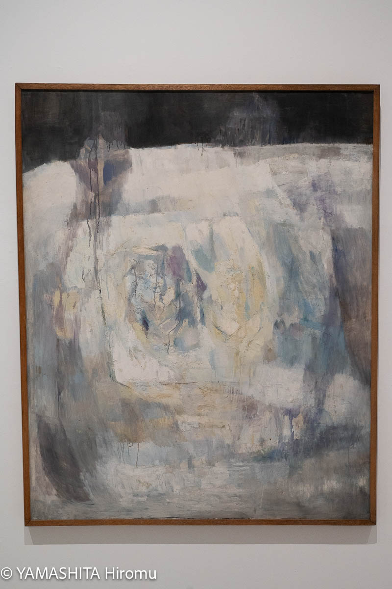

青森まで行ってきました。
仙台から青森までのドライブはなかなかで、まぁ、疲れました。特に往きは雨天でしたし。

でも、青森は快晴で、雲がとてもいい感じでした。

これは岩木山、津軽富士というやつですね。

## 三内丸山遺跡

快晴なのはいいのだけど、まぁ、暑い。

出土品

三内丸山遺跡の出土品じゃないのだけど、クマ形だって

無理、かわいい

## 青森県立美術館

行ってきました。

このアオモリ犬が居るところ。

奈良美智さんの作品をたくさん見れてよかった。

佐野ぬいさんの企画展も良かったです。

これが気に入ったのだけど、作品名見てくるの忘れてしまいました。

企画展は2025/10/13まで。

https://www.aomori-museum.jp/schedule/16385/

 (https://www.aomori-museum.jp/assets/uploads/2025/05/1750657385-a2d6a4074f3396240a1969b6afbd8cc6.jpg)