## はじめに：初めての青森へ。遺跡とでかい犬を求めて。

青森ね、行ってみたいと思ったことなかったんですよ。
だから、同じ東北で生まれ育ったのに、今まで足を踏み入れたことがなかったわけです。

ただ、最近、少しだけ旅を楽しめるようになってきたので、近いところを"コンプリート"するのも悪くないかと思いった次第。（今回で東北をコンプリートしました）

仙台から青森までのドライブは、想像以上に距離があり、特に往路はあいにくの雨模様で、まぁ、なかなかの道のりでした。

けど、青森は晴れてて良かったですよ。

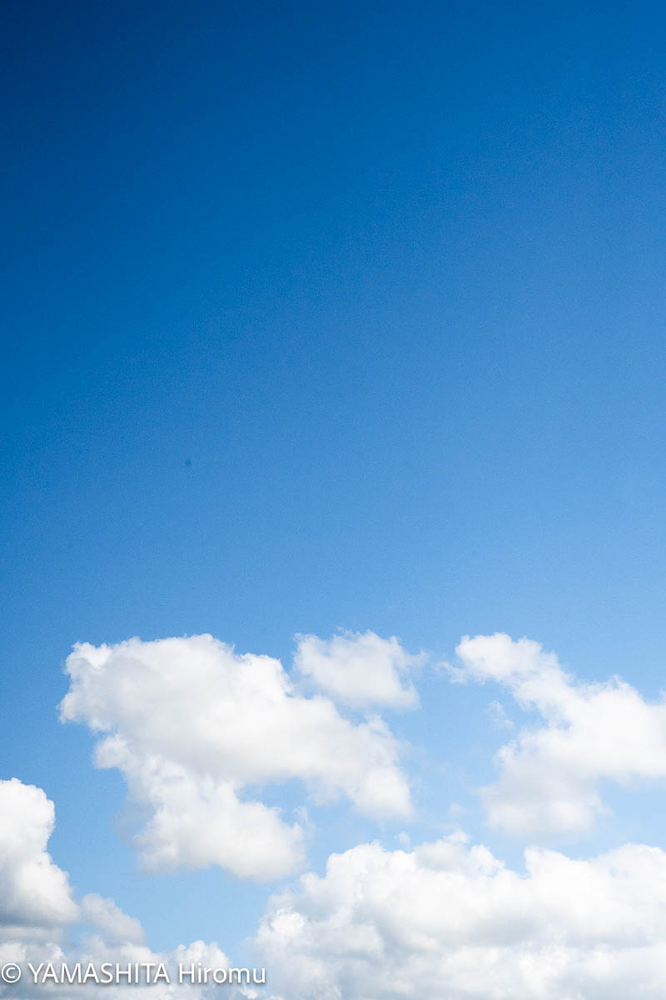

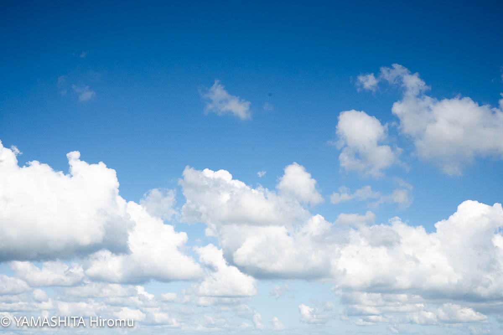

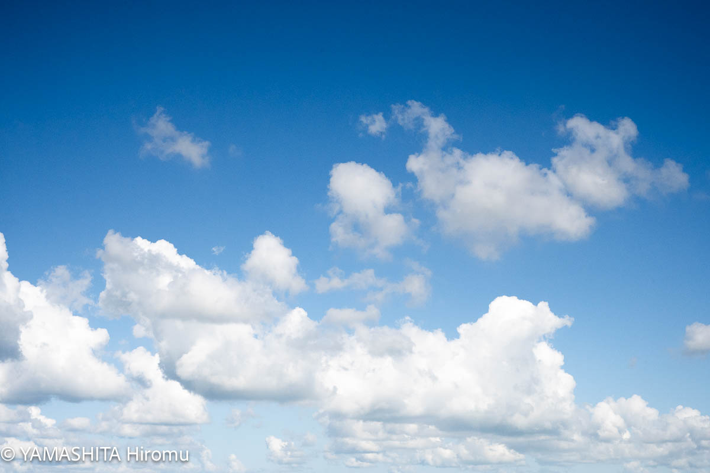

これは津軽富士・岩木山ですね。

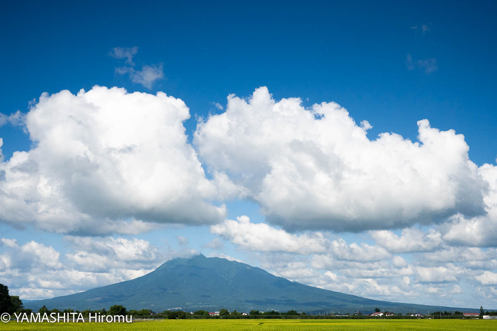

## 三内丸山遺跡

夏休みの観光地なので、それなりに人は居たんですが、Lightroomの「人を消す機能」が活躍してくれました。綺麗サッパリ消してくれて便利！

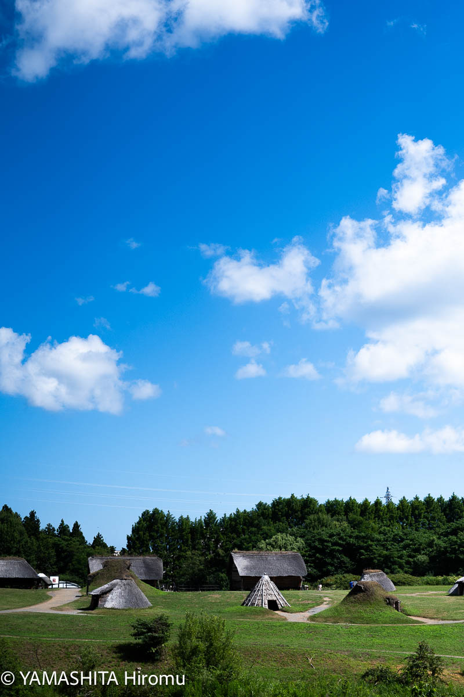

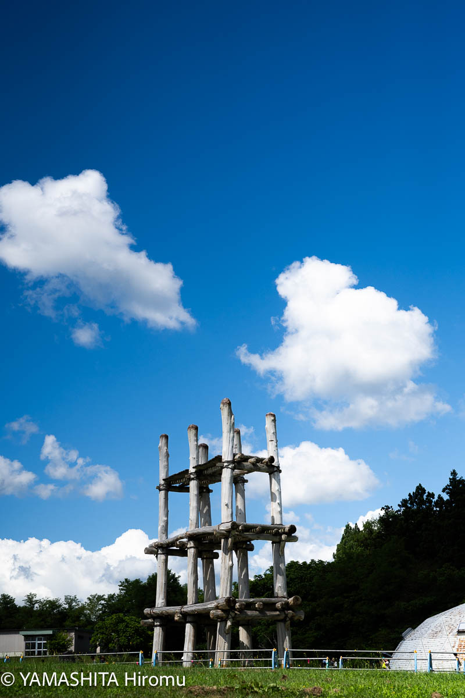

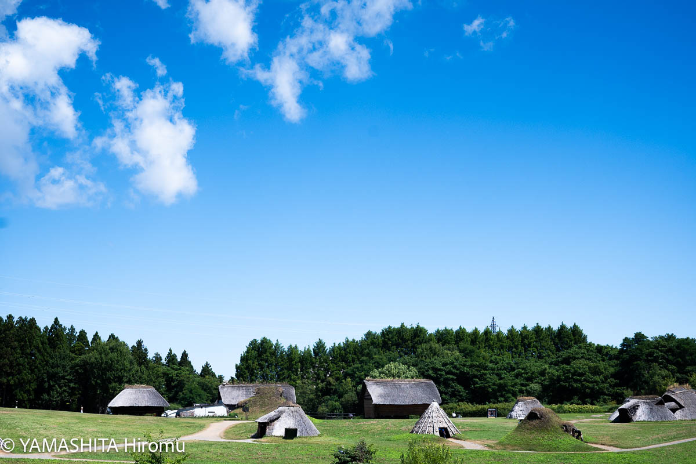

遺跡から出土した土器や土偶なども展示されてました。

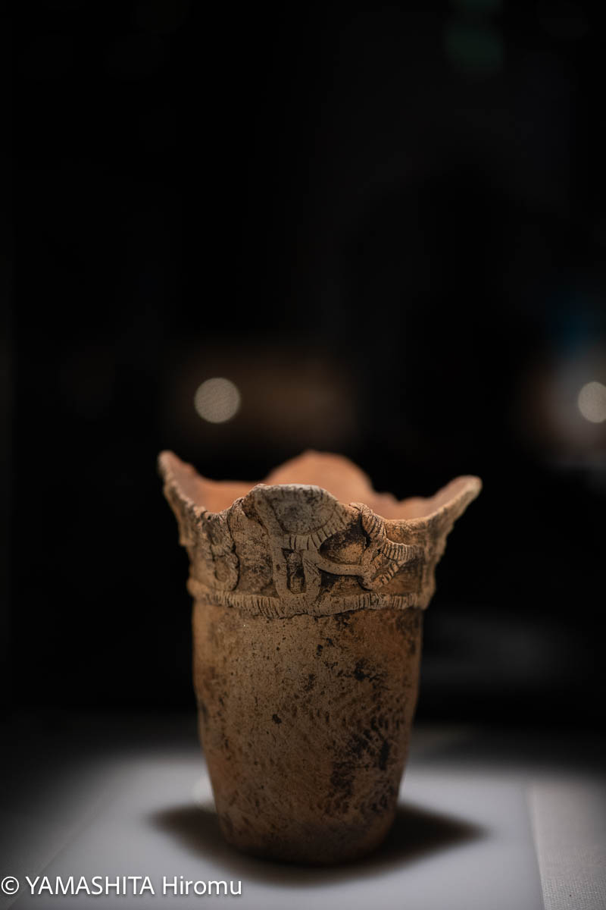

三内丸山遺跡の出土品ではないのですが、クマの形をした土製品です。

無理、かわいい。

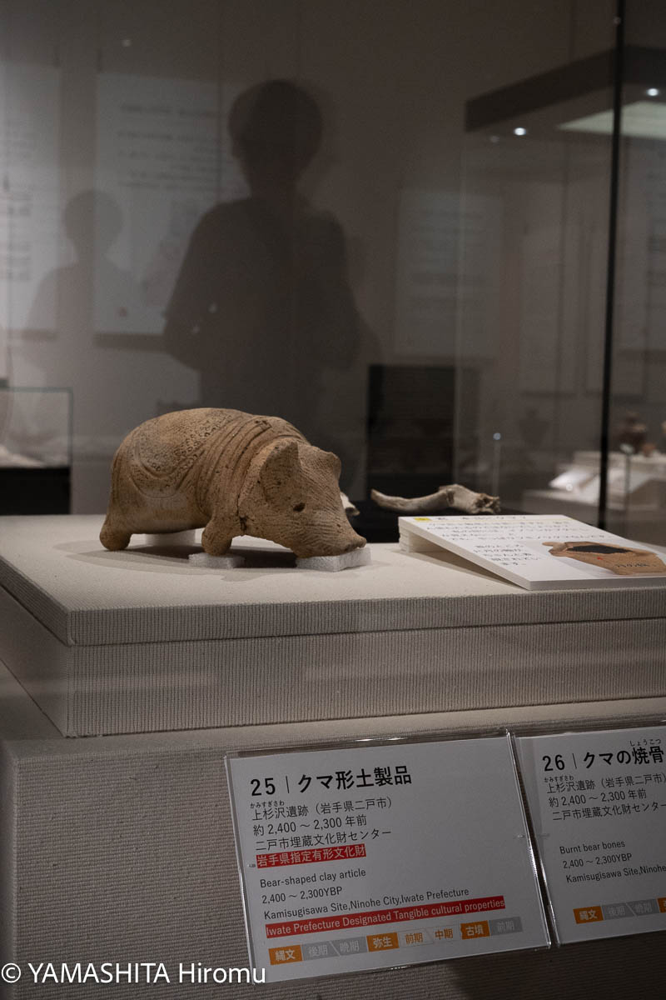

## 青森県立美術館

目当てのアオモリ犬。

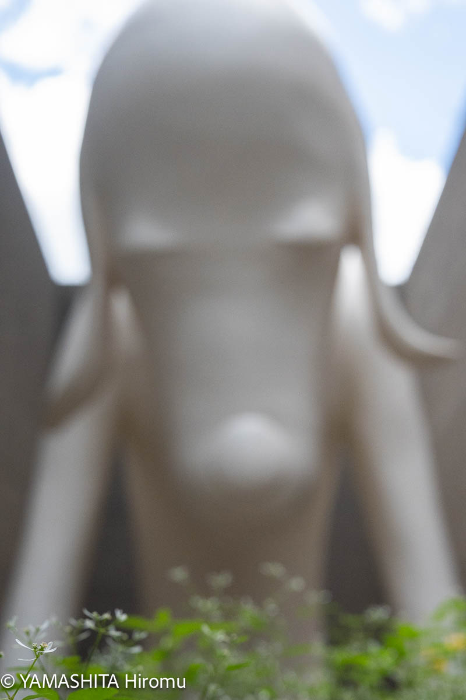

館内では、奈良美智さんの作品をたくさん見れてよかったです。

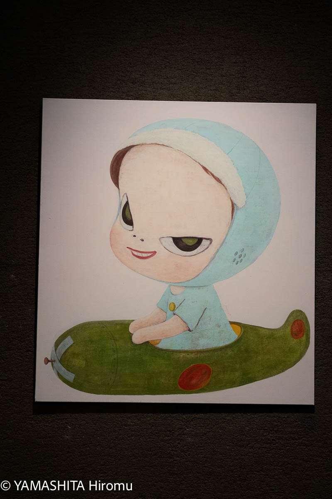

また、佐野ぬいさんの企画展も開催されており、こちらも非常に見応えがありました。この企画展は2025年10月13日まで開催されているとのことなので、興味のある方はぜひ足を運んでみてください。

[青森県立美術館 公式サイト - 佐野ぬい展](https://www.aomori-museum.jp/schedule/16385/)