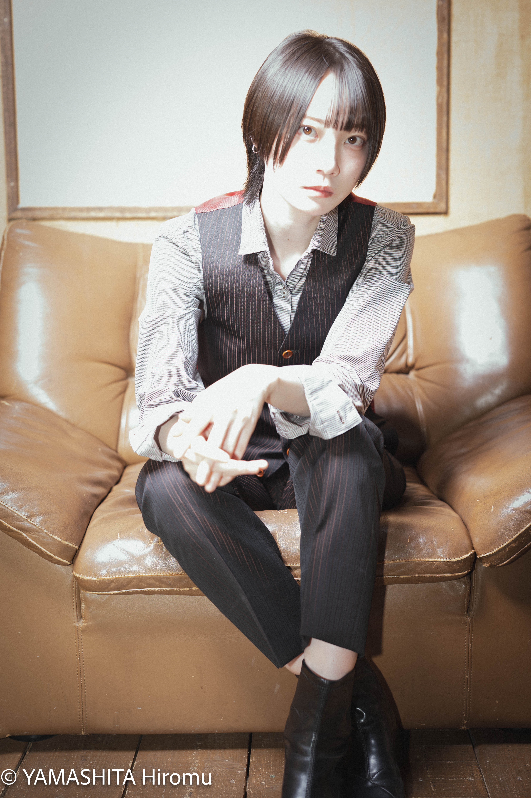
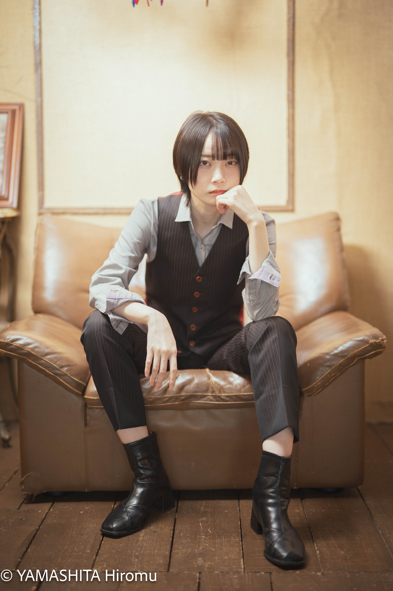
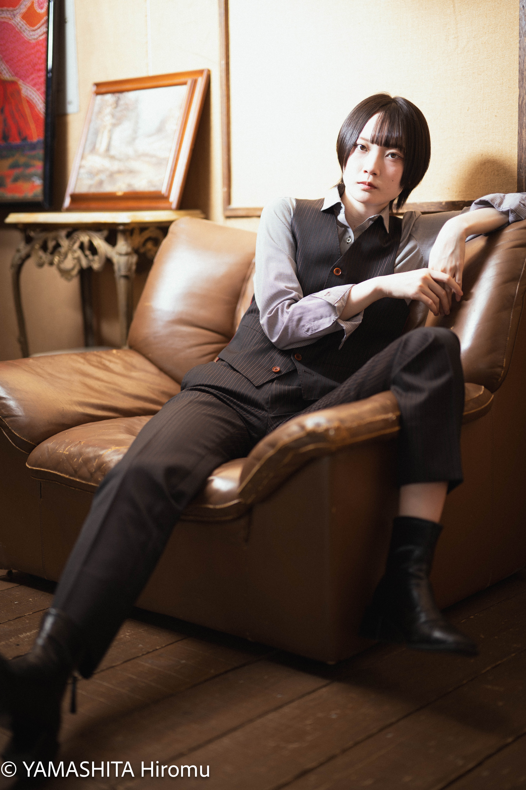
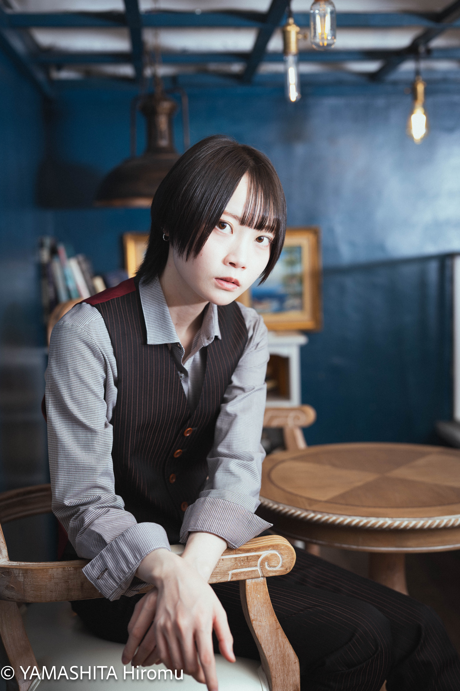
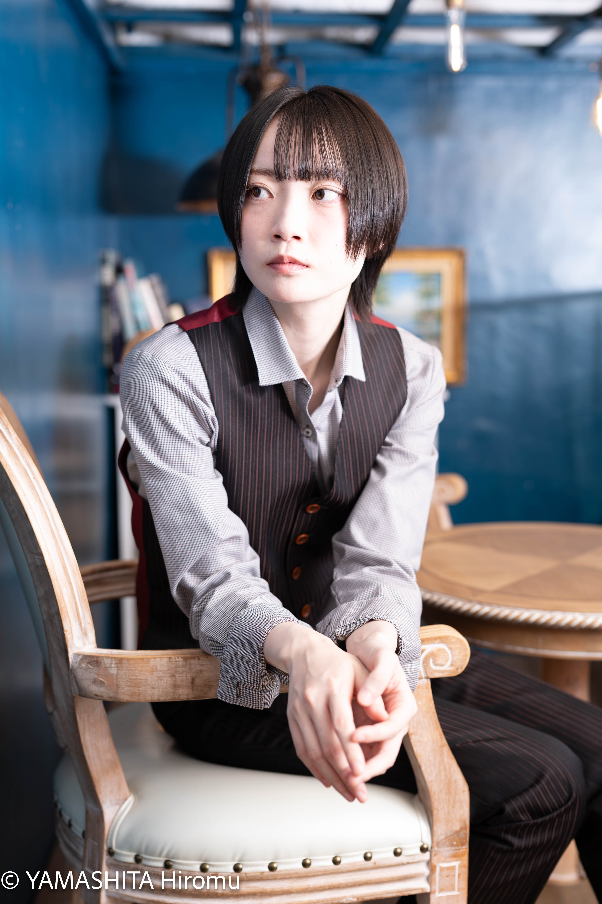

初めてストロボを炊いて撮影するのにチャレンジしてみたんだけど、まぁ、難しくて。
例えばこれなんですが、完全に顔のディティールを飛ばしてしまってまして。

結果的に印象的な写真になったから載せていますが、意図した結果では全然なくて。
モデルになってくれた片岡奈央乃さんの存在感でなんとかなった感はあります。

次はもうちょい意図して光をコントロールしたいところ。（今日のスタジオなら、ストロボは使わない、という選択をきちんとできるといいのかなと思います）

比較的うまくいったものを掲載します。

